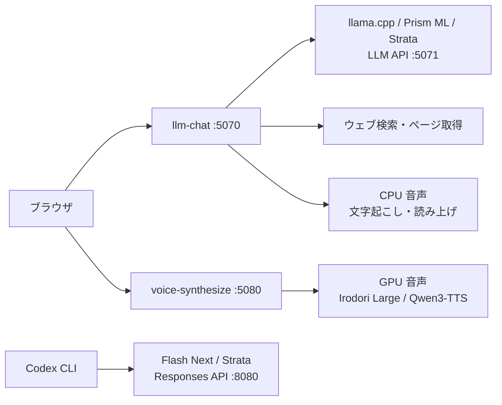

# ローカル LLM & 音声制作環境

**チャット、画像への質問、ウェブ検索、音声会話、音声作品制作、ローカルモデルでの Codex を、一つの作業環境で。**

WSL2 + Dev Container 上で、llama.cpp・Prism ML・Strata を使って LLM を動かすためのリポジトリです。
ブラウザからモデルを切り替える `llm-chat`、Irodori / Qwen3-TTS による `voice-synthesize`、
起動スクリプト・設定・導入と運用の記録をまとめています。

**[使い始める](#使い始める)** · **[現在のモデル](#現在の-llm)** · **[構成](#構成)** · **[ドキュメント](#ドキュメント)**

> **このリポジトリの範囲**
>
> ソースコードと設定・手順書を管理しています。モデルの重み、推論エンジン本体、音声データは別途取得します。
> 以下は 2026-10-09 時点の構成です。

## できること

| 入口 | 主な機能 | 詳細 |
| --- | --- | --- |
| **チャット** · `localhost:5070` | 4 モデルの切り替え、思考モード・コンテキスト長の調整、会話履歴の保存と再開 | [llm-chat](llm-chat/README.md) |
| **画像・ウェブ検索** · チャット内 | 画像の添付・貼り付け、必要に応じた検索とページ取得、出典付きの回答 | [画像添付](llm-chat/README.md#画像添付) / [ウェブ検索](docs/03-web-search.md) |
| **音声会話** · チャット内 | マイク録音の文字起こし、AivisSpeech / VOICEVOX / Irodori による読み上げ、声ライブラリ | [音声チャット](docs/06-voice-chat.md) / [Irodori](docs/08-irodori-tts.md) |
| **音声作品制作** · `localhost:5080` | 声の説明や参照 WAV から長文合成、複数話者の原稿、作品の保存・再制作・ZIP 出力 | [voice-synthesize](voice-synthesize/README.md) |
| **ローカル Codex** · ターミナル | Flash Next を専用プロファイルで利用、API 監視画面とリクエスト・応答の記録 | [Codex 連携](codex/README.md) |

## 使い始める

### 初めて導入する場合

この環境の構築・実測条件は **RTX 5070（VRAM 12GB）、物理 RAM 64GB / WSL 上限 48GB、Ubuntu 24.04** です。
Python 環境とアプリの起動には `uv` を使います。ハードウェアや依存ツールの詳細は [環境一覧](docs/README.md#環境) を参照してください。

使いたい機能に合わせて、先に必要なファイルを取得します。

| 使いたい機能 | 導入するもの | 手順 |
| --- | --- | --- |
| Qwen3.5 / Gemma 4 のチャット | llama.cpp、選んだモデルの GGUF、画像エンコーダー | [モデルのセットアップ](docs/01-setup-models.md) |
| Bonsai Abliterated のチャット | Prism ML 版 llama.cpp、PQ2_0 の GGUF、画像エンコーダー | [Prism ML fork の導入](docs/01-setup-models.md#bonsai-2-専用の-prism-ml-fork) |
| Flash Next のチャット・Codex | Strata、SC117 IQ3_XXS、MTP、画像エンコーダー | [Strata の導入・運用](docs/07-strata.md) |
| 録音・読み上げ | faster-whisper のモデル、使う音声エンジンと音声モデル | [音声チャットの導入](docs/06-voice-chat.md) |
| Irodori / Qwen の音声制作 | 各 TTS の専用ランタイムとモデル | [Irodori](docs/08-irodori-tts.md) / [Qwen3-TTS](docs/09-qwen-tts.md) |

セットアップ文書には過去に使ったモデルの手順・実測も残っています。現在保持している LLM は [下の 4 モデル](#現在の-llm) です。
Flash Next の `setup.sh` は既存の Strata・MTP・画像モデルがある環境向けなので、新規導入では Strata の手順から始めてください。

### チャットを開く

導入済みの環境では、次のコマンドで起動できます。以下の例は `/workspace/LLM` に配置した場合です。

```bash
cd /workspace/LLM/llm-chat
uv run llm-chat
```

1. ブラウザで **[http://localhost:5070](http://localhost:5070)** を開く。
2. 画面上部でモデルを選び、**「切り替え」** を押す。
3. 状態が **`ready`** になったらメッセージを送る。

画像は「画像添付」または貼り付けで追加できます。「履歴を保存」をオンにすると会話を JSON / Markdown で保存し、後から続きを話せます。
ウェブ検索と読み上げは起動時オフ。必要なときに画面からオンにします。ウェブ検索を使う場合、検索語と閲覧 URL は外部サービスへ送信されます。

### 音声作品を制作する

初回は使う TTS をセットアップします。Irodori と Qwen はそれぞれ導入できます。

```bash
cd /workspace/LLM
bash irodori-tts/setup.sh   # Irodori を使う場合
bash qwen-tts/setup.sh      # Qwen3-TTS を使う場合
```

制作画面を起動します。

```bash
cd /workspace/LLM
bash voice-synthesize/serve.sh
```

**[http://localhost:5080](http://localhost:5080)** で音声エンジンを選び、声の説明と原稿を入力して作品を合成します。
参照 WAV のアップロードや、`[speaker A]` / `[speaker B]` で区切った複数話者の原稿にも対応しています。
完成 WAV・原稿・設定・作品専用の参照音声はまとめて保存され、ZIP で取得できます。
操作の詳細は [音声制作の README](voice-synthesize/README.md) を参照してください。

GPU 音声の起動時はチャットの LLM をアンロードし、制作中の LLM 再ロードをブロックします。
終了時は **「音声OFF・GPU解放」** を押し、チャット側で使うモデルを再度ロードします。制作 UI は `llm-chat` が停止していても利用できます。

### Codex からローカルモデルを使う

Strata と Flash Next の導入後、初回に専用プロファイルを設定します。

```bash
cd /workspace/LLM
uv run codex/setup.py
```

```bash
# ターミナル 1: ローカルモデルのサーバー
cd /workspace/LLM
bash qwen3.8-flash-next/serve-codex.sh
```

```bash
# ターミナル 2: Codex に作業させたいディレクトリで実行
codex -p qwen
```

`codex -p qwen` はローカルの Flash Next を使い、通常の `codex` は GPT を使います。
**[API 監視画面](http://localhost:8080/api-monitor)** で入力・思考テキスト・応答を確認できます。
設定と記録の詳細は [Codex の README](codex/README.md) を参照してください。

## 現在の LLM

各モデルの `model.toml` がチャット UI の一覧と既定コンテキスト長を定義しています。
現在の 4 モデルはいずれも画像入力に対応しています。

| モデル | 量子化・種類 | 推論エンジン / 配置 | チャットの既定コンテキスト |
| --- | --- | --- | ---: |
| **Qwen3.5-9B** | UD-Q5_K_XL · Dense 9B | llama.cpp / 全層 GPU | 32K |
| **Gemma 4 26B-A4B** | UD-Q4_K_XL · MoE 26B / active 4B | llama.cpp / GPU + CPU | 32K |
| **Ternary Bonsai 2 27B Abliterated** | Hikari07jp v0.1 · PQ2_0 · Dense 27B | Prism ML fork / 全層 GPU を優先 | 16K |
| **Qwen3.8 Flash Next 125B SC117** | Abliterated IQ3_XXS · MoE 125B / active 6B | Strata resident / GPU + RAM + SSD | 128K |

1K は 1024 トークンです。UI では最大 256K まで指定できますが、対応上限はこの PC での動作を保証する値ではありません。
Flash Next は統合 UI 経由で 128K・192K の起動と短い応答を確認済みで、256K の実機動作は未検証です。
Codex 用 Flash Next の設定は別管理で 128K。詳細は [コンテキスト長](llm-chat/README.md#コンテキスト長) を参照してください。

> **GPU の使い分け**
>
> この VRAM 12GB 構成では LLM は 1 モデルずつ使い、チャット用と Codex 用のサーバーも切り替えて利用します。
> AivisSpeech / VOICEVOX / Irodori Small-MF の会話用読み上げは CPU、Irodori Large / Qwen3-TTS の声作成・作品合成は GPU を使います。
> Flash Next と CPU 音声の併用でも RAM 使用量は増えるため、実測条件は [Strata](docs/07-strata.md) と [音声チャット](docs/06-voice-chat.md) を参照してください。

## 構成



チャットは各ディレクトリの `model.toml` を読み、選んだモデルの `serve.sh` を起動します。
モデルの切り替え時は前のプロセスを停止し、履歴を引き継ぎます。
`serve.sh` は単体でも使え、既定では `http://127.0.0.1:5071/v1` に OpenAI 互換 API を提供します。

```text
LLM/
├── llm-chat/                         統合チャット UI・検索・音声・履歴
├── voice-synthesize/                 独立した音声制作 UI と保存先
├── codex/                            ローカル Codex の設定・セットアップ
├── qwen3.5-9b/                       モデル設定・起動スクリプト
├── gemma4-26b-a4b/                    モデル設定・起動スクリプト
├── ternary-bonsai-2-27b-abliterated/   モデル設定・起動スクリプト
├── qwen3.8-flash-next/                Strata のチャット・Codex 用ラッパー
├── llama.cpp/                        共有推論エンジンのラッパー
├── llama-prism/                      Bonsai 専用エンジンのラッパー
├── strata/                           取得・ビルドした Strata（Git 管理外）
├── Strata-data/                      Flash Next・MTP 等（Git 管理外）
├── aivisspeech/・voicevox/            CPU 読み上げエンジンの起動スクリプト
├── irodori-tts/・qwen-tts/            音声モデルの導入・バックエンド
├── download-mmproj.sh               Qwen3.5・Gemma・Bonsai の画像モデル取得
└── docs/                             構築記録・運用・実測
```

## ドキュメント

詳細の入口は **[ドキュメント一覧](docs/README.md)**。目的に合わせて以下から進めます。

| 読みたい内容 | ドキュメント |
| --- | --- |
| モデル・推論エンジンの導入、単体 API、性能実測 | [01 · セットアップ](docs/01-setup-models.md) |
| チャットの設計、API、会話履歴 | [02 · チャット UI](docs/02-chat-ui.md) |
| 検索ツール、プロバイダ追加、思考ループ対策 | [03 · ウェブ検索](docs/03-web-search.md) |
| ローカル Codex の設定・コンテキスト・GPU 運用 | [04 · Codex](docs/04-codex.md) |
| 起動停止、ログ、メモリ、トラブル対応 | [05 · 運用](docs/05-operations.md) |
| 録音・文字起こし・AivisSpeech・VOICEVOX | [06 · 音声チャット](docs/06-voice-chat.md) |
| Flash Next SC117、Strata の導入と実測 | [07 · Strata](docs/07-strata.md) |
| Irodori、声ライブラリ、CPU / GPU 合成 | [08 · Irodori-TTS](docs/08-irodori-tts.md) |
| Qwen の声作成・クローン・長文制作 | [09 · Qwen3-TTS](docs/09-qwen-tts.md) |
| 保存容量、モデルの役割、整理の実施結果 | [10 · 容量調査](docs/10-storage-audit.md) |

## 保存先と Git 管理

| データ | 保存先 | Git 管理 |
| --- | --- | --- |
| ソース、起動スクリプト、`model.toml`、ロックファイル、手順書 | 各アプリ・モデルのディレクトリ | 対象 |
| ダウンロードした重み・推論エンジン・TTS ランタイム | `models/`、`bin/`、`runtime/`、`Strata-data/` など | 対象外 |
| 保存した会話（JSON / Markdown） | `llm-chat/history/` | 対象外 |
| 会話用の声ライブラリ | `llm-chat/voice-library/` | 対象外 |
| 音声作品（WAV・原稿・設定・参照音声・ZIP） | `voice-synthesize/productions/` | 対象外 |
| Codex の入力・応答記録 | `qwen3.8-flash-next/codex-traces/` | 対象外 |

除外ルールは [.gitignore](.gitignore) で管理しています。クローン後は必要な重みとランタイムを各環境で取得し直してください。
認証情報・会話履歴・音声作品は private リポジトリでもコミットしません。

```bash
# コミット前に追加対象を確認
git status --short

# 指定したパスの除外理由を確認
git check-ignore -v <パス>
```

新しいモデルや生成物を追加した場合は `.gitignore` も更新します。既に追跡済みのファイルには除外ルールが効かないため、
必要なら `git rm --cached <パス>` で追跡を外します。秘密情報をコミットした場合は、履歴からの除去と認証情報の更新が必要です。
